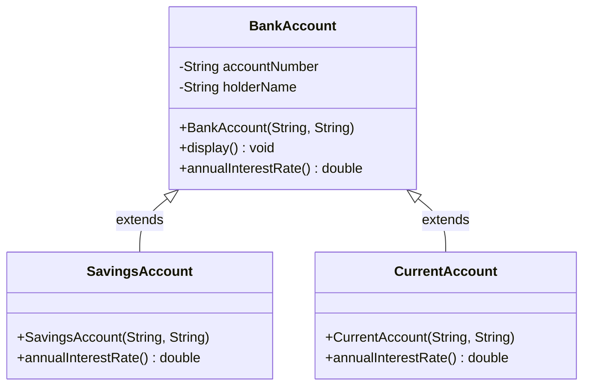
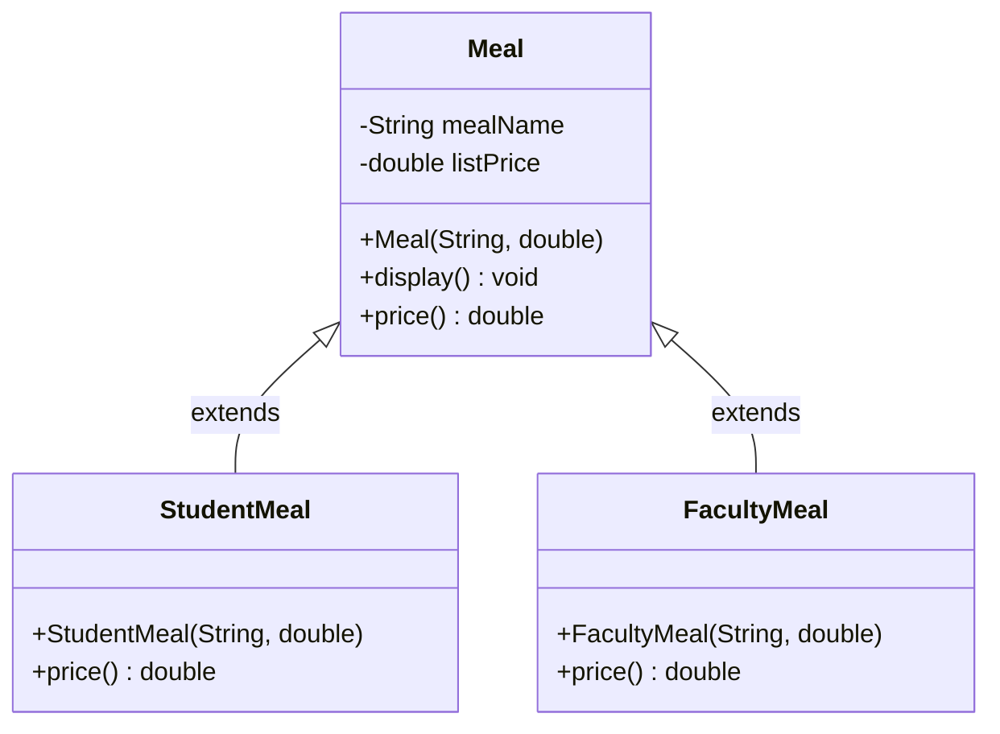
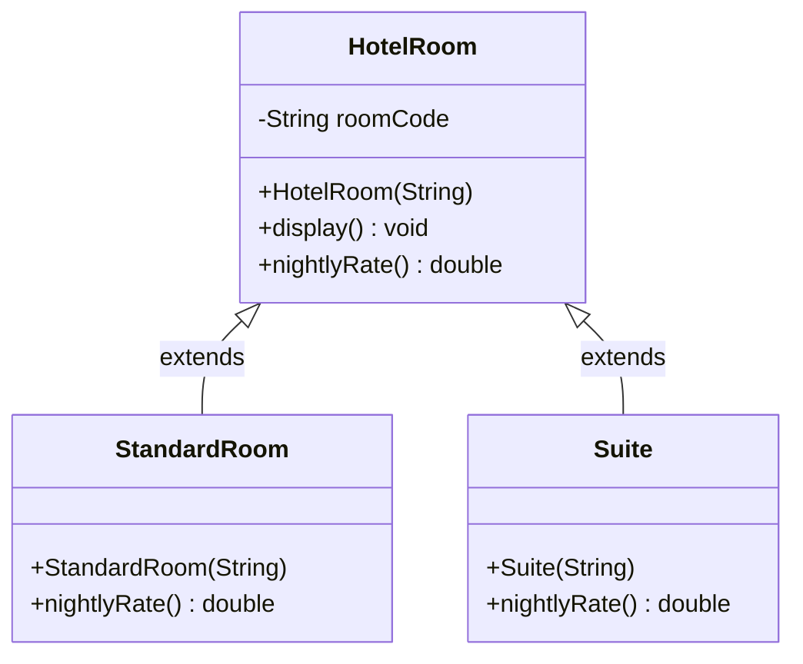
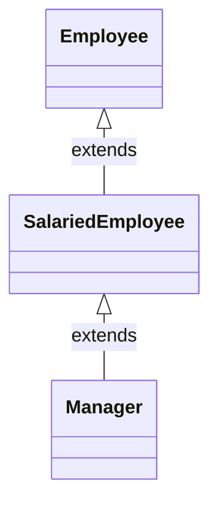

# Lab 10: Inheritance — Three-Class Hierarchies (Is-a)

## Table of Contents
1. [Introduction](#introduction)
2. [Topic Explanations](#topic-explanations)
3. [UML class diagrams](#uml-class-diagrams)
4. [Progressive Tasks](#progressive-tasks)
5. [Practice Tasks](#practice-tasks)
6. [Submission Guidelines](#submission-guidelines)

---

## Introduction

This lab continues **inheritance** (`extends`, `super()`, **method overriding**). Unlike Lab 9 (one superclass and **one** subclass per story), each progressive task here uses **three classes**:

- **One superclass** (the general idea: e.g. any bank account).
- **Two subclasses** (two specialized kinds: e.g. **savings** and **current** account).

Both subclasses **`extend` the same** superclass. They **share** the parent’s fields and methods but **override** rules where the real world differs (interest, price, rent, etc.).

**Method budget (progressive tasks):**  
In each task, the **superclass defines two instance methods** (plus constructors). **Each subclass overrides at least one** of those methods (same name and parameters, new behavior). You may add **`@Override`** for clarity. **Constructors are not counted** as methods in this budget.

**Objectives:**
- Build a **small hierarchy** with **one parent and two children**.
- Explain **why** each subclass overrides a method (real-life rule).
- Use **`super(...)`** in every subclass constructor and **`super.method()`** when an overridden method should **extend** the parent’s output.

**Prerequisites:** Lab 9 (inheritance basics). Polymorphism is **not** required for this lab.

---

## Topic Explanations

### 1. One parent, two children

```
        BankAccount
       /           \
SavingsAccount   CurrentAccount
```

Both **SavingsAccount** and **CurrentAccount** **are** **BankAccount**s. They inherit `display()` (or similar) unless they override it. They **replace** behavior for methods like `annualInterestRate()` when the bank’s rules differ.

### 2. Same method name, different bodies

- **SavingsAccount** might return **4%** interest.
- **CurrentAccount** might return **0%** interest (typical for checking).
- Same method name `annualInterestRate()`, different `return` values.

### 3. Lab 9 vs Lab 10

| Lab | Structure |
|-----|-----------|
| **9** | 1 superclass + **1** subclass per task |
| **10** | 1 superclass + **2** subclasses per task |

---

## UML class diagrams

These diagrams follow **UML-style class notation**: arrows point from **subclass → superclass** (in Mermaid, `<|--` reads “child inherits parent”). Fields and methods match the **progressive tasks** in this lab (your own names may vary slightly).

**Viewing:** [GitHub](https://github.com) and many editors render **Mermaid** inside markdown. If you see only code blocks, use the **ASCII** copies below each diagram.

<a id="uml-task1-banking"></a>
### Task 1 — Banking (`BankAccount` hierarchy)



**ASCII (same structure):**

```
+-------------------+
|    BankAccount    |
+-------------------+
| - accountNumber   |
| - holderName      |
+-------------------+
| + display()       |
| + annualInterest  |
|   Rate() : double |
+-------------------+
         ^
         | extends
    +----+----+
    |         |
+-----------+ +-------------+
| Savings   | | Current     |
| Account   | | Account     |
+-----------+ +-------------+
| + annual  | | + annual    |
|   Interest| |   Interest  |
|   Rate()  | |   Rate()    |
+-----------+ +-------------+
```

---

<a id="uml-task2-meal"></a>
### Task 2 — Cafeteria (`Meal` hierarchy)



**ASCII:**

```
+-------------------+
|       Meal        |
+-------------------+
| - mealName        |
| - listPrice       |
+-------------------+
| + display()       |
| + price() : double|
+-------------------+
         ^
         | extends
    +----+----+
    |         |
+-----------+ +------------+
| Student   | | Faculty    |
| Meal      | | Meal       |
+-----------+ +------------+
| + price() | | + price()  |
+-----------+ +------------+
```

---

<a id="uml-task3-hotel"></a>
### Task 3 — Hotel (`HotelRoom` hierarchy)



**ASCII:**

```
+-------------------+
|    HotelRoom      |
+-------------------+
| - roomCode        |
+-------------------+
| + display()       |
| + nightlyRate()   |
|   : double        |
+-------------------+
         ^
         | extends
    +----+----+
    |         |
+-----------+ +--------+
| Standard  | | Suite  |
| Room      | |        |
+-----------+ +--------+
| + nightly | | + nightly|
|   Rate()  | |   Rate() |
+-----------+ +--------+
```

---

### Practice tasks — extra diagrams (optional)

**Practice A — three-level chain (`Employee` → `SalariedEmployee` → `Manager`):**



**ASCII:**

```
    Employee
        ^
        | extends
 SalariedEmployee
        ^
        | extends
     Manager
```

**Practice B, C, D — two subclasses under one parent (same pattern as Tasks 1–3):**

| Practice | Superclass   | Subclass A    | Subclass B     |
|----------|--------------|---------------|----------------|
| B        | `Parcel`     | `BoxParcel`   | `FragileParcel`|
| C        | `Course`     | `LabCourse`   | `OnlineCourse` |
| D        | `TeamMember` | `Player`      | `Coach`        |

You can draw the same **triangle** as Task 1–3: one box on top, two boxes below, inheritance arrows up.

---

## Progressive Tasks

**Rules (all three tasks):**

1. **Three classes** per task: **superclass** + **subclass A** + **subclass B** (both extend superclass).
2. Superclass: **two** instance methods (not counting constructors) — see tables.
3. Each subclass: **override at least one** method from the superclass (you may override both if you wish; keep code readable).
4. **`Main`:** create **one object of each** type (parent + both children) and print enough output to show **different** behavior.
5. Use **private** fields and **getters** only if needed; getters do **not** count toward the “two methods” in the superclass if you use them only for internal use — prefer keeping the lab to the listed methods.

---

### Task 1: Banking — `BankAccount`, `SavingsAccount`, `CurrentAccount`

**UML:** See [Task 1 — Banking](#uml-task1-banking) under [UML class diagrams](#uml-class-diagrams) (Mermaid + ASCII).

**Real-life story:**  
A bank offers **accounts**. Every account has an **account number** and **holder name**. The bank applies **different rules** for **savings** (interest on deposits) and **current** (checking-style: often **no** or **very low** interest, but **higher daily movement**). All are still **bank accounts** for the software.

**Classes (three):**

| Class | Role |
|-------|------|
| `BankAccount` | General account: default interest and default **daily withdrawal limit**. |
| `SavingsAccount` | **Savings** product: **higher** interest; withdrawal limit may be **stricter** (bank policy). |
| `CurrentAccount` | **Current / checking** product: **lower or zero** interest; **higher** withdrawal limit for frequent transactions. |

**Fields (private, suggested):**

| Class | Fields |
|-------|--------|
| `BankAccount` | `accountNumber` (String), `holderName` (String). |
| `SavingsAccount` | No extra fields required, or optional `minimumBalance` if you want (not required). |
| `CurrentAccount` | No extra fields required. |

**Superclass — `BankAccount` — two methods:**

| Method | Real-life meaning | What the code should do |
|--------|-------------------|-------------------------|
| `display()` | Mini statement: who owns this account. | Print **account number** and **holder name** (and optionally a label like `"Account type: General"`). |
| `annualInterestRate()` | Default yearly interest **percent** for a generic account. | Return a `double`, e.g. **0.5** (meaning 0.5% per year — document your convention in a comment). |

**Subclass — `SavingsAccount extends BankAccount`:**

| Method | Real-life meaning | What the code should do |
|--------|-------------------|-------------------------|
| (constructor) | Open a savings account. | First line: `super(accountNumber, holderName);` |
| `annualInterestRate()` **(override)** | Savings should earn **more** interest than the default. | Return a **higher** rate than `BankAccount` (e.g. **4.0**). Use `@Override`. |

**Subclass — `CurrentAccount extends BankAccount`:**

| Method | Real-life meaning | What the code should do |
|--------|-------------------|-------------------------|
| (constructor) | Open a current account. | First line: `super(accountNumber, holderName);` |
| `annualInterestRate()` **(override)** | Current accounts often pay **no** or **minimal** interest. | Return **0.0** or **0.1** — **lower** than savings and **not higher** than the parent’s default if your story is “no interest”. Use `@Override`. |

**Optional (only if your instructor allows extra methods):** override `display()` in one subclass to add `"Savings"` / `"Current"` using `super.display()` first.

**In `Main`:**  
- Create: `new BankAccount(...)`, `new SavingsAccount(...)`, `new CurrentAccount(...)`.  
- For each, call `display()` and print `annualInterestRate()`.  
- Show that **savings** interest **>** generic **≥** current (adjust numbers so this is true).

---

### Task 2: Cafeteria — `Meal`, `StudentMeal`, `FacultyMeal`

**UML:** See [Task 2 — Cafeteria](#uml-task2-meal) under [UML class diagrams](#uml-class-diagrams).

**Real-life story:**  
The cafeteria sells **meals** with a **menu name** and a **list price**. **Student meals** and **faculty meals** are still **meals**, but the **price charged** differs: students get a **large discount**, faculty often get a **moderate** discount compared with the public list price.

**Classes (three):**

| Class | Role |
|-------|------|
| `Meal` | **List** meal: name + **standard** price (walk-in / guest). |
| `StudentMeal` | Same meal concept; **student** pricing. |
| `FacultyMeal` | Same meal concept; **faculty** pricing. |

**Fields (private, suggested):**

| Class | Fields |
|-------|--------|
| `Meal` | `mealName` (String), `listPrice` (double). |
| `StudentMeal` | Use `super(mealName, listPrice)` — price rules in `price()` override. |
| `FacultyMeal` | Same. |

**Superclass — `Meal` — two methods:**

| Method | Real-life meaning | What the code should do |
|--------|-------------------|-------------------------|
| `display()` | Show meal name and list price. | Print **meal name** and **list price**. |
| `price()` | Full price (guest / no discount). | Return **`listPrice`** unchanged (the “sticker” price). |

**Subclass — `StudentMeal extends Meal`:**

| Method | Real-life meaning | What the code should do |
|--------|-------------------|-------------------------|
| (constructor) | e.g. `StudentMeal(String mealName, double listPrice)` | First line: `super(mealName, listPrice);` |
| `price()` **(override)** | Student pays **less** — e.g. **50%** of list. | Return `listPrice * 0.50` (or use `super.price()` and multiply). Document the rule in a comment. |

**Subclass — `FacultyMeal extends Meal`:**

| Method | Real-life meaning | What the code should do |
|--------|-------------------|-------------------------|
| (constructor) | e.g. `FacultyMeal(String mealName, double listPrice)` | First line: `super(mealName, listPrice);` |
| `price()` **(override)** | Faculty pays **less than list** but **usually more than student**. | Return e.g. **`listPrice * 0.75`** — must be **>** student price and **<** list for the same `listPrice`. |

**In `Main`:**  
- Use the **same** `mealName` and `listPrice` for all three (e.g. `"Biryani"`, `300`).  
- Create `Meal`, `StudentMeal`, `FacultyMeal`.  
- Print `display()` for each and print `price()` for each — show **student < faculty < guest list** (or **student ≤ faculty < list**).

---

### Task 3: Hotel — `HotelRoom`, `StandardRoom`, `Suite`

**UML:** See [Task 3 — Hotel](#uml-task3-hotel) under [UML class diagrams](#uml-class-diagrams).

**Real-life story:**  
A hotel manages **rooms**. Every booking has a **room code** (e.g. `"204"`). **Standard rooms** and **suites** are both **hotel rooms**, but **nightly rent** differs: standard is **mid** range; **suite** is **premium**. You can also model a **base** `HotelRoom` as the cheapest “economy” or generic tier if you prefer — the tables below use **base = lowest** rent.

**Classes (three):**

| Class | Role |
|-------|------|
| `HotelRoom` | **Base** room tier: smallest rent (economy / default). |
| `StandardRoom` | **Standard** tier: **higher** than base. |
| `Suite` | **Suite** tier: **highest** rent. |

**Fields (private, suggested):**

| Class | Fields |
|-------|--------|
| `HotelRoom` | `roomCode` (String). |
| `StandardRoom` | `super(roomCode)` only, or add `bedCount` (int) optionally. |
| `Suite` | `super(roomCode)` only, or add `livingRooms` (int) optionally. |

**Superclass — `HotelRoom` — two methods:**

| Method | Real-life meaning | What the code should do |
|--------|-------------------|-------------------------|
| `display()` | Show which room this is. | Print **room code** only (e.g. `"Room: 101"`). Do **not** put `"Standard"` or `"Suite"` here unless you also **override** `display()` in those subclasses — otherwise one shared `display()` is fine for all three types. |
| `nightlyRate()` | Nightly rent for this **tier** (base = cheapest in this lab). | Return a `double`, e.g. **3000.0** for the base tier. |

**Subclass — `StandardRoom extends HotelRoom`:**

| Method | Real-life meaning | What the code should do |
|--------|-------------------|-------------------------|
| (constructor) | e.g. `StandardRoom(String roomCode)` | First line: `super(roomCode);` |
| `nightlyRate()` **(override)** | Standard room costs **more** than base. | Return e.g. **5500.0** — **>** base rate. |
| Optionally override `display()` | Show `"Standard"` in addition to room code. | Optional: call `super.display()` then print one line. |

**Subclass — `Suite extends HotelRoom`:**

| Method | Real-life meaning | What the code should do |
|--------|-------------------|-------------------------|
| (constructor) | e.g. `Suite(String roomCode)` | First line: `super(roomCode);` |
| `nightlyRate()` **(override)** | Suite is **most expensive**. | Return e.g. **12000.0** — **>** standard **>** base. |
| Optionally override `display()` | Show `"Suite"`. | Optional: call `super.display()` then print one line. |

**In `Main`:**  
- Create one `HotelRoom`, one `StandardRoom`, one `Suite` (you may use different room codes, e.g. `"101"`, `"205"`, `"501"`).  
- For each, call `display()` and print `nightlyRate()`.  
- Show **base < standard < suite** rates.

---

## Practice Tasks (challenging — complete any **two**)

These are **optional** but **harder**: more rules, validation, or **three levels** of inheritance. Read the whole task before coding.

---

### Practice A — Payroll: `Employee` → `SalariedEmployee` → `Manager`

**Story:**  
Everyone is an **employee** with a **name** and **employee ID**. A **salaried employee** has a **fixed monthly salary**. A **manager** is a **salaried employee** with a **bonus percent** on top of base salary.

**Classes (three levels):**

1. **`Employee`** — fields: `name`, `employeeId` (String). Methods: `display()` prints name and ID; `monthlyPay()` returns **0.0** or a small default (document).
2. **`SalariedEmployee extends Employee`** — field: `monthlySalary` (double). Constructor: `super(name, employeeId)`. Override `monthlyPay()` to return `monthlySalary`. Override `display()` to call `super.display()` and print salary.
3. **`Manager extends SalariedEmployee`** — field: `bonusPercent` (double, e.g. 10 for 10%). Constructor: `super(name, employeeId, monthlySalary)`. Override `monthlyPay()` to return `super.monthlyPay() * (1 + bonusPercent/100)` (or equivalent). Override `display()` to show bonus.

**Hard requirements:**
- If `monthlySalary < 0` or `bonusPercent < 0`, do **not** update / use **0** in `monthlyPay()` (validate in constructor or setters).
- **`Main`:** create one `Employee` (contract worker with 0 pay), one `SalariedEmployee`, one `Manager`; print `monthlyPay()` for each.

---

### Practice B — Shipping: `Parcel`, `BoxParcel`, `FragileParcel`

**Story:**  
Logistics handles **parcels**. Each has a **tracking ID** and **weight** (kg). A **box** parcel uses a **flat** shipping cost formula. A **fragile** parcel adds **insurance** as a percent of base cost.

**Classes:**

1. **`Parcel`** — fields: `trackingId` (String), `weightKg` (double). Methods: `display()` prints ID and weight; `shippingCost()` returns **50.0 + weightKg * 10** (example formula — document).
2. **`BoxParcel extends Parcel`** — optional field: `lengthCm` (double). Override `shippingCost()` to add **flat 25** to `super.shippingCost()` (or your own rule — document).
3. **`FragileParcel extends Parcel`** — field: `insurancePercent` (double). Override `shippingCost()` to return `super.shippingCost() * (1 + insurancePercent/100)`.

**Hard requirements:**
- If `weightKg <= 0`, `shippingCost()` returns **0** and you may print a warning from `display()` or ignore cost.
- **`Main`:** same weight, compare all three costs.

---

### Practice C — Course registration: `Course`, `LabCourse`, `OnlineCourse`

**Story:**  
A university offers **courses**. Each has a **code** and **credit hours**. **Lab courses** add a **lab fee**. **Online courses** apply a **technology fee** per credit.

**Classes:**

1. **`Course`** — fields: `courseCode` (String), `creditHours` (int). Methods: `summary()` prints code and credits; `totalFee()` returns `creditHours * 3000` (example base per credit — document).
2. **`LabCourse extends Course`** — field: `labFee` (double). Override `totalFee()` to return `super.totalFee() + labFee`.
3. **`OnlineCourse extends Course`** — field: `techFeePerCredit` (double). Override `totalFee()` to return `super.totalFee() + creditHours * techFeePerCredit` (get credit hours via getters or `super` logic).

**Hard requirements:**
- `creditHours` must be **1–6**; if invalid in constructor, set to **3** and document.
- **`Main`:** same `creditHours`, compare fees for all three types.

---

### Practice D — Sports team: `TeamMember`, `Player`, `Coach`

**Story:**  
A **team member** has a **name** and **team code**. A **player** has a **jersey number**. A **coach** has **years of experience** and a different **role** string.

**Classes:**

1. **`TeamMember`** — fields: `name`, `teamCode`. Methods: `display()`; `role()` returns `"Member"`.
2. **`Player extends TeamMember`** — field: `jerseyNumber` (int). Override `role()` to return `"Player"`. Override `display()` to include jersey (call `super.display()` first).
3. **`Coach extends TeamMember`** — field: `yearsExperience` (int). Override `role()` to return `"Coach"`. Override `display()` to include years.

**Hard requirements:**
- Jersey number **1–99**; invalid → set **0** and document.
- **`Main`:** store `Player` and `Coach` in a `TeamMember[]` array of length 2, loop and print `role()` for each (introduces light polymorphism — optional for advanced students).

---

## Submission Guidelines

1. Complete all **3 progressive tasks** with **three classes each**:  
   - Task 1: `BankAccount`, `SavingsAccount`, `CurrentAccount`  
   - Task 2: `Meal`, `StudentMeal`, `FacultyMeal`  
   - Task 3: `HotelRoom`, `StandardRoom`, `Suite`
2. One **`Main`** (or separate mains per task if your course allows) demonstrating all nine objects / behaviors.
3. **Practice:** complete **any two** of A–D with full comments and validation where required.
4. Submit as your course requires (zip of `.java` files or Word with code).

---

## Notes

- **Two subclasses** sharing **one** superclass is a common exam pattern — practice drawing the triangle diagram.
- Use **`@Override`** whenever you override a method.
- **First line** of each subclass constructor: **`super(...)`** with parameters the parent needs.
- If you later study **polymorphism**, you will use `BankAccount b = new SavingsAccount(...);` — not required here.
