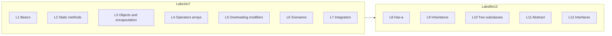

# Topics after Lab 12: coverage map and suggestions

**Course:** CSC-150 – Object Oriented Programming  
**Purpose:** This document maps what Labs 1–12 already cover, lists typical **remaining** topics for a first Java OOP course, and suggests a **Lab 13+** order. Instructors should reconcile numbering and pacing with the **official CSC-150 syllabus** and **contact hours**.

---

## What Labs 1–12 already cover

| Lab | Focus |
|-----|--------|
| [Lab1.md](Lab1.md) | Java intro: syntax, types, variables, I/O, basics |
| [Lab2.md](Lab2.md) | **Static** methods, parameters/returns, control inside methods, String/Array in methods, Math, `args` |
| [Lab3.md](Lab3.md) | Classes/objects, instance methods, constructors, **encapsulation**, getters/setters, `this` |
| [Lab4.md](Lab4.md) | Operators, control flow, OOP basics, **arrays** (broader fundamentals) |
| [Lab5.md](Lab5.md) | Overloading, object params/returns, modifiers, **static/final**, varargs, strings |
| [Lab6.md](Lab6.md) | Scenario/problem-solving with methods + OOP |
| [Lab7.md](Lab7.md) | **Integration** review Labs 1–6 |
| [Lab8.md](Lab8.md) | **Has-a**: association, aggregation, composition |
| [Lab9.md](Lab9.md) | **Inheritance** (`extends`, `super`, override) |
| [Lab10.md](Lab10.md) | Inheritance: **one parent, two children** |
| [Lab11.md](Lab11.md) | **Abstract** classes/methods |
| [Lab12.md](Lab12.md) | **Interfaces**, `implements`, contract vs abstract class |

| [Lab13.md](Lab13.md) | **Polymorphism**, **`Object`** (`toString`, `equals`), **exceptions** (`try`/`catch`, `throws`, custom) — **combined** (former Lab 13 + Lab 14 topics) |

**Already implicit in Labs 9–12 but not a standalone lab title:** polymorphic variables (e.g. `Measurable m = new Rectangle(...)`), `Object` as the root type, and `equals` / `toString` as design topics.

---

## Syllabus and contact-hour alignment (instructor checklist)

Use this when mapping **Lab 13+** to the **official CSC-150 weekly schedule**:

1. **Match topics to published weekly outcomes** — If the syllabus lists “exceptions” before “collections,” follow the syllabus order even if it differs slightly from the table below.
2. **Contact hours** — Combine thin topics (e.g. enums + nested classes) into one lab if time is short, or split polymorphism vs. `Object` methods across two sessions if needed.
3. **Assessment timing** — Schedule **exceptions** and **file I/O** before any project milestone that requires robust input handling.
4. **Renumbering** — If your course only runs to Lab 14, merge suggested labs (e.g. packages + classpath as a short add-on to another lab).

This file does **not** replace the department’s official syllabus; it is a **reference map** only.

---

## What is still “remaining” overall (typical gaps)

Typical next chapters for a Java OOP I course **after interfaces**:

1. **Polymorphism and the `Object` class** — Covered together with **exceptions** in **[Lab13.md](Lab13.md)** (single lab).
2. **Packages and `javac` / `java` with folders** — `package` declaration, default vs `public`, **classpath** basics.
3. **Collections and generics (intro)** — **`ArrayList<E>`**, optionally **`HashMap<K,V>`**; iteration; use where growth or lookup matters (not a full replacement for arrays).
4. **File I/O** — `Path` / `Files` or `Scanner` + `File`, **try-with-resources**; pairs with exceptions (students already saw **`try`/`catch`** in Lab 13).
5. **Enums** — Type-safe constants (e.g. order status); small modeling tool.
6. **Optional / advanced (if time):** nested / static nested classes, **lambda + functional interfaces** (builds on Lab 12), JUnit basics, simple design patterns (e.g. Strategy), GUI (Swing/JavaFX) as a separate track.

**Usually not dedicated labs in OOP I:** recursion as its own lab (often inside earlier labs), multithreading, streams API, networking—often a second course or elective.

---

## Recommended order for Labs 13+ (default)

| Suggested lab | Topic | Rationale |
|---------------|--------|-----------|
| **Lab 13** | **Polymorphism + `Object` + exceptions** (see [Lab13.md](Lab13.md)) | One lab: `toString`/`equals`, `try`/`catch`, `throws`, custom exception — unifies Labs 9–12 behavior with **robust** APIs. |
| **Lab 14** | Packages + classpath | Scales projects; supports standard folder layout. |
| **Lab 15** | `ArrayList` / collections + generics intro | Industry-standard; e.g. “list of `Payable`.” |
| **Lab 16** | File I/O + try-with-resources | Persistence; builds on Lab 13 exception handling. |
| **Lab 17** (optional) | Enums (and/or nested classes) | Small; closes common modeling gaps. |

---

## Choosing the first lab after Lab 12 (decision guide)

**Default: [Lab13.md](Lab13.md)** — Polymorphism, `Object` methods, and exceptions are **combined** in one session; use the map’s **Lab 14+** row if you need **collections earlier** (some syllabi teach `ArrayList` before packages).

Pick based on **next exam or project date**: inheritance/interfaces assessments align with **Lab 13**; **data-heavy** projects may add an early **collections** mini-lab or move **Lab 15** earlier.

---

## Short summary

- **Core OOP storyline** (classes → relationships → inheritance → abstract → interfaces) is **largely complete** through Lab 12.
- **Remaining for a rounded Java OOP I course:** **[Lab 13](Lab13.md)** covers **polymorphism / `Object` / exceptions** together; then **packages**, **collections/generics**, **file I/O**, and optionally **enums** and **lambdas**, plus any **review or capstone** lab your syllabus requires.

---

## Document history

- Added as a curriculum reference for post–Lab 12 planning (Spring 2026).
- Updated: **[Lab13.md](Lab13.md)** added as combined Lab 13 (polymorphism + exceptions); suggested **Lab 14+** numbering shifted accordingly.
